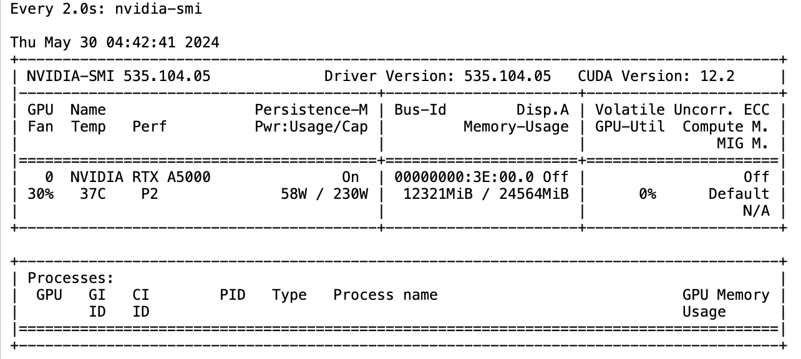
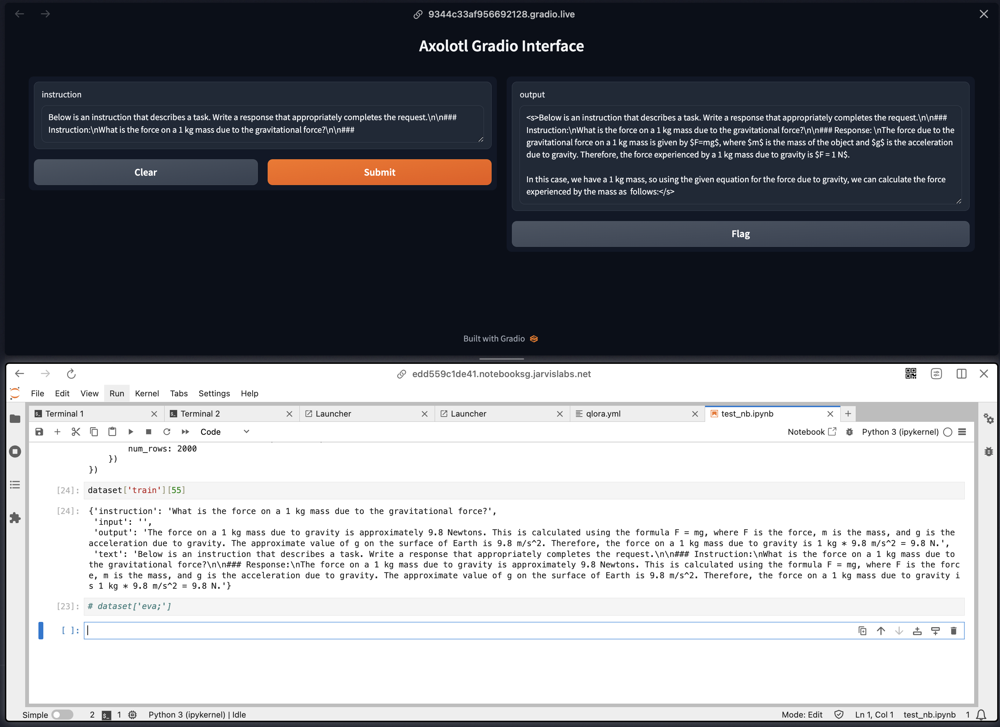

## Quick Links
- **Clone Axolotl Repository**: [GitHub - Axolotl](https://github.com/OpenAccess-AI-Collective/axolotl/tree/main)
- **Weights & Biases Run**: [W&B - mistral7b_alpaca](https://wandb.ai/askmuhsin/mistral7b_alpaca?nw=nwuseraskmuhsin)
- **Model on 🤗**: [Hugging Face - Mistral-7B-v0.1](https://huggingface.co/mistralai/Mistral-7B-v0.1)
- **Dataset on 🤗**: [Hugging Face - alpaca_2k_test](https://huggingface.co/datasets/mhenrichsen/alpaca_2k_test)

## commands to run -- 
Before running move the `qlora.yml` file to `/home/axolotl/examples/mistral/`
```
## prepare dataset
CUDA_VISIBLE_DEVICES="" python -m axolotl.cli.preprocess  /home/axolotl/examples/mistral/qlora.yml
## train model
accelerate launch -m axolotl.cli.train /home/axolotl/examples/mistral/qlora.yml
## infrence
accelerate launch -m axolotl.cli.inference /home/axolotl/examples/mistral/qlora.yml --lora_model_dir="./outputs/qlora-out" --gradio
```

gpu details -- 
gradio sample -- 


tips to debug -- https://hamel.dev/blog/posts/axolotl/

## Qlora-out README (autogenerated)
---
license: apache-2.0
library_name: peft
tags:
- generated_from_trainer
base_model: mistralai/Mistral-7B-v0.1
model-index:
- name: outputs/qlora-out
  results: []
---

<!-- This model card has been generated automatically according to the information the Trainer had access to. You
should probably proofread and complete it, then remove this comment. -->

[](https://github.com/OpenAccess-AI-Collective/axolotl)
<details><summary>See axolotl config</summary>

axolotl version: `0.4.1`
```yaml
base_model: mistralai/Mistral-7B-v0.1
model_type: MistralForCausalLM
tokenizer_type: LlamaTokenizer

load_in_8bit: false
load_in_4bit: true
strict: false

datasets:
  - path: mhenrichsen/alpaca_2k_test
    type: alpaca
    # shards: 20
dataset_prepared_path: last_run_prepared
val_set_size: 0.1
output_dir: ./outputs/qlora-out

adapter: qlora
lora_model_dir:

sequence_len: 8192
sample_packing: true
pad_to_sequence_len: true

lora_r: 32
lora_alpha: 16
lora_dropout: 0.05
lora_target_linear: true
lora_fan_in_fan_out:
lora_target_modules:
  - gate_proj
  - down_proj
  - up_proj
  - q_proj
  - v_proj
  - k_proj
  - o_proj

wandb_project: mistral7b_alpaca
wandb_entity:
wandb_watch:
wandb_name:
wandb_log_model:

gradient_accumulation_steps: 4
micro_batch_size: 2
num_epochs: 1
optimizer: adamw_bnb_8bit
lr_scheduler: cosine
learning_rate: 0.0002

train_on_inputs: false
group_by_length: false
bf16: auto
fp16:
tf32: false

gradient_checkpointing: true
early_stopping_patience:
resume_from_checkpoint:
local_rank:
logging_steps: 1
xformers_attention:
flash_attention: true

loss_watchdog_threshold: 5.0
loss_watchdog_patience: 3

warmup_steps: 10
evals_per_epoch: 4
eval_table_size:
eval_max_new_tokens: 128
eval_sample_packing: false
saves_per_epoch: 1
debug:
deepspeed:
weight_decay: 0.0
fsdp:
fsdp_config:
special_tokens:

```

</details><br>

# outputs/qlora-out

This model is a fine-tuned version of [mistralai/Mistral-7B-v0.1](https://huggingface.co/mistralai/Mistral-7B-v0.1) on the None dataset.
It achieves the following results on the evaluation set:
- Loss: 0.9372

## Model description

More information needed

## Intended uses & limitations

More information needed

## Training and evaluation data

More information needed

## Training procedure

### Training hyperparameters

The following hyperparameters were used during training:
- learning_rate: 0.0002
- train_batch_size: 2
- eval_batch_size: 2
- seed: 42
- gradient_accumulation_steps: 4
- total_train_batch_size: 8
- optimizer: Adam with betas=(0.9,0.999) and epsilon=1e-08
- lr_scheduler_type: cosine
- lr_scheduler_warmup_steps: 10
- num_epochs: 1

### Training results

| Training Loss | Epoch  | Step | Validation Loss |
|:-------------:|:------:|:----:|:---------------:|
| 0.8621        | 0.1667 | 1    | 1.1288          |
| 0.9514        | 0.3333 | 2    | 1.1233          |
| 0.9946        | 0.6667 | 4    | 1.0765          |
| 1.1953        | 1.0    | 6    | 0.9372          |


### Framework versions

- PEFT 0.11.1
- Transformers 4.41.1
- Pytorch 2.1.2+cu118
- Datasets 2.19.1
- Tokenizers 0.19.1